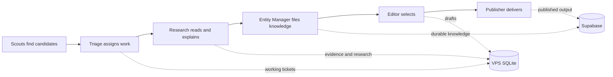

# Feed pipeline: how it works, why work fails, and what to clean

Audit date: September 29, 2026. Source: read-only inspection of the VPS SQLite
stores, saved runtime state, process-manager lifecycle records, and the current
repository. No paid inference was run. No application code or job records were
changed. Fresh verified backups of the two main VPS databases were created.
Five unused Mac experiment databases were archived reversibly after inspection.

## The system in six verbs

**Find → read → explain → file → select → publish.**

| Step | Responsibility | What it leaves behind |
|---|---|---|
| Scout / source collector | Finds an article, post, or market change worth examining. | A candidate observation. |
| Admission / triage | Decides whether to research it, defer it, and what resources it gets. | A signal, decision, and work ticket. |
| Research: retrieve, then synthesize | Reads available evidence and produces a structured account of what it says. | Evidence and a research packet; the packet may be complete, partial, or failed. |
| Entity Manager | Selects the legitimate entity, validates support, and saves or reconciles knowledge. | Durable entity memories, or a recorded rejection/failure. |
| Editor | Decides what deserves a feed story and prepares a draft. | An editorial decision/draft. |
| Publisher | Turns approved material into the published product. | Published narratives and their references. |



SQLite is the **working desk**: observations, queues, evidence, research, drafts,
and execution history. Supabase is the **durable library and published product**.
Deleting the working desk does not reconstruct it from Supabase; some useful
research has never reached the library.

An entity work ticket marked `complete` does not mean a feed post was published.
It means that stage finished handling the ticket, including permitted keep/drop
decisions. Editorial publication is a separate decision.

## The status words to remember

| Word | Meaning | Usual response |
|---|---|---|
| Pending | Waiting for a compatible worker and an eligible time window. | Check worker availability, research depth, and deadline. |
| Leased | One worker has temporary ownership. | Check its heartbeat before intervening. |
| Retry wait | A temporary failure has another attempt scheduled. | Inspect the cause and scheduled retry. |
| Complete | This work ticket reached its successful terminal state. | Do not rerun it merely because there is no published story. |
| Expired | Its freshness window has ended. | Preserve history; deliberately reassess before restarting research. |
| Dead letter | Automatic processing stopped after a permanent failure or exhausted retries. | Diagnose the reason, then recover a selected group or retain it as history. |
| Deferred | Triage chose not to admit research immediately. | Needs a reconsideration policy; it is not automatically a worker failure. |

A `started` execution event is an immutable historical entry. Counting every
started event as an unfinished session is wrong: its matching terminal event
may already exist. Likewise, old source tables and the canonical queue are
different views of work and must not be added together as independent jobs.

The stored attempt count also spans pipeline stages. A successful ticket may
show three attempts for retrieval, synthesis, and entity handling; that does
not mean it failed three times. A useful dashboard must distinguish stage
execution from retries after failure.

## What is actually on the VPS

| Store | Approximate size at inspection | Purpose |
|---|---:|---|
| `news.sqlite` | 1.24 GB | News observations, canonical queue, evidence, packets, and events. |
| `pipeline.sqlite` | 363 MB | Polymarket working state, canonical queue, evidence, packets, editorial drafts. |
| `x-desk.sqlite` | 149 MB | Social candidates and delivery state; 29,082 pending candidates. |
| `classification.sqlite` | Small | General Jev classification control/audit tables; zero recorded attempts in this store. |
| `entity-identity-shadow.sqlite` | 74 KB | Separate identity-classification experiment; four attempt records. |
| SQLite health journal | 25.9 MB | 79,831 heartbeat entries; no write-error entries in the inspected journal. |
| Existing backup directory | 2.32 GB before this audit's new backups | 33 database files, ten manifests, and sidecar/debris files. |

Five August 16 news experiment databases on the Mac, about 4.6 MB including
their sidecars, have now been moved into a dated archive. These are separate
from the VPS production queue. The Mac's other news/Hyperliquid databases, wallet/swap database, and
older report archive should not be treated as disposable merely by location.

Before the new backups, the VPS had roughly 25 GB free. The two main databases had almost
no free pages to reclaim. Running VACUUM alone would not materially reduce them.
Most occupied space is real evidence, packets, and execution history.

### Current execution state

- No matching scout/shared-research/shared-entity worker process was running.
- PM2 lifecycle logs show the feed workers receiving a stop sequence on
  September 27; the process manager itself exited on September 28.
- Saved process definitions say stopped. The last worker snapshots are from
  September 27 and must not be presented as current live health.
- That last research snapshot supports light research only. Standard search,
  deep research, and provider fallback are disabled in it.
- The reason the stop was requested is not established here. Nothing was
  restarted as part of this audit.

## The actual queue totals

These are **current terminal dispositions across the retained history**, not
failure rates for new arrivals today. They are counted from the canonical work
table, once per work ticket.

| Source | Complete | Dead letter | Still pending | Total |
|---|---:|---:|---:|---:|
| News | 10,152 | 16,511 | 66 | 26,729 |
| Polymarket | 600 | 4,042 | 45 | 4,687 |
| **Total** | **10,752** | **20,553** | **111** | **31,416** |

Every one of the 111 pending tickets is past its deadline. Ninety-five request
standard research, which the last recorded runtime cannot perform. Sixteen
are light-research tickets at different stages. There are no current leased
or retry-wait tickets in these two canonical queues.

Older source tables still show 28,267 pending news observations and 287 pending
Polymarket candidates. Those are not evidence of another 28,554 currently
actionable canonical jobs. Dashboards must state which table/state machine they
measure and reconcile the relationship before reporting backlog.

Triage also retains 539 deferred news signals and 871 deferred Polymarket
signals. Those have not become the canonical research tickets counted above.

## Why the work ends in dead letters

| Recorded category | Jobs | What the evidence establishes |
|---|---:|---|
| Budget exceeded | 6,986 | Historical token/output/time/response-size limits; distinct causes are grouped under one name. |
| Invalid structured output | 4,575 | Includes a large research-to-Entity-Manager policy mismatch, not just malformed JSON. |
| Entity resolution failed | 3,367 | A complete research packet existed, but later identity/admission handling failed. |
| Unsafe/disallowed URL | 3,078 | Mostly a publisher redirect rejected by the domain policy. |
| Permanent source error | 1,372 | Mostly inaccessible, missing, or failed source retrieval; also missing usable evidence. |
| Provider authentication | 582 | Concentrated on September 2–3; historical provider configuration failures. |
| Retrieval timeout | 366 | Fetches exhausted their available time/retries. |
| Retrieval blocked | 227 | Mostly rate-limited HTTP responses. |

### 1. Research and Entity Manager disagree about acceptable output

Research can save a packet as `partial` or `failed`. The Entity Manager adapter
rejects both for these sources. It records that rejection as
`invalid_structured_output`.

This explains **3,503** stored dead letters: 3,216 partial packets and 287 failed
packets. I replayed the pure packet adapter against all 7,341 dead-letter jobs
that have a stored packet. It reproduced these exact rejections without any
model or network call. Complete packets passed the adapter in this audit.

**Improvement:** agree on a handoff rule. Failed research should remain a
research outcome. A partial result needs an explicit retain/enrich/review
decision before Entity Manager, rather than entering a stage known to reject
it. Do not label this situation as broken JSON or indiscriminately accept
unsupported claims.

### 2. The configured repair allowance cannot be used

All 31,416 stored work tickets specify one provider call and one repair. The
gateway counts a repair as a provider call, and requires another call to be
available. After the initial call, no repair can run.

**Improvement:** explicitly choose either one call with no repair or a budget
that includes a bounded repair. Measure how often repair improves the result.
Increasing the worker's retry count does not resolve this contract conflict.

### 3. A predictable redirect creates thousands of retrieval failures

For 2,884 news dead letters, the recorded failure is a redirect to `panews.io`
outside the approved domain policy. A recent affected job's allowed domain was
`www.panewslab.com`. The policy is derived from the original source hostname.

**Improvement:** review publisher-specific redirect destinations and maintain
explicit approved mappings, with normal public-address and redirect checks.
Do not disable URL safety or interpret every domain-policy rejection as an
actually malicious source. Requeue only after fixing the applicable policy.

### 4. Stale pending work has no effective expiry sweep

Claim queries require a future freshness deadline. Recovery resets expired
leases and due retries; it does not terminalize an unleased pending ticket
whose deadline is already past. The worker's own expiry preflight cannot help
a ticket that the claim query will never select.

**Improvement:** bounded, audited expiration of stale pending tickets, with
the indexed columns and serialized work state updated together. Also stop
admitting or recovering research depths the enabled worker cannot serve.
The 111 existing rows are status-correction candidates, not data-deletion
candidates.

### 5. Entity failures need useful, safe reason codes

The 3,367 complete packets recorded as entity-resolution failures pass current
packet validation and packet-local admission validation. That does not test
the historical model decision, shortlist, collision query, or database write.
The failure detail retained for all of them is a generic redacted message.

Current code can produce this category for unsupported entity choices,
invalid support references, and name/alias collisions. The stored diagnostic
does not identify which of those caused each historical failure.

**Improvement:** retain a safe reason code and enough bounded decision metadata
to distinguish these failures. Do not remove evidence/identity validation to
make the queue look healthier. Recover representative groups using saved
packets after their actual cause is established.

### 6. Distinguish historical budget failures from code loaded by a worker

Historical details include 4,474 news jobs rejected for exceeding output-token
budget and 1,740 jobs rejected for input-token budget. The Hermes adapter also
estimates usage from text length and does not forward the structured request's
output cap into its oneshot call.

A September 24 commit removed synthesis token caps from current source. Saved
worker start times precede that commit, and budget failures continued afterward.
This is strong evidence of workers continuing with previously loaded code;
the exact in-memory build cannot be verified after those processes exited.

**Improvement:** record the deployed revision in runtime snapshots and verify
the running revision after an authorized rollout. Evaluate current behavior
before applying another historical-budget fix. Retain time/call limits and
measure the actual provider usage where available.

## Cleanup: separate clutter from knowledge

Fresh backups have been created and verified for both main VPS stores. The
integrity result was `ok`, source/backup row-count comparisons matched, and the
backup manifests contain hashes and schema identity.

No rows have been deleted, requeued, marked complete, or expired. No historical
backups have been pruned. Local housekeeping was limited to the five unused
Mac experiment databases. Production status correction and retention remain
unapplied; their scope and recovery policy still need to be settled.

| Group | Proposed handling | Why |
|---|---|---|
| 111 stale pending tickets | Correct to expired with backup, per-row audit, and consistent JSON/indexed state. | Removes misleading live backlog without erasing work. |
| 20,553 dead letters | Preserve and classify; recover only reviewed groups. | Historical failures are evidence, not clutter to hide. |
| 7,341 dead letters with a saved packet | Inspect/reuse the packet where valid; do not blindly repeat research. | Some are partial/failed; existence is not proof of a complete or acceptable result. |
| 86 old backup sidecar files | Archive after verifying ownership is closed and no WAL contains unapplied work. | Includes zero-byte WALs, SHMs, and temporary backup sidecars; about 1.4 MB, not a major space saving. |
| 23 older backups without a manifest | Retain until separately restore-verified. | Missing a modern manifest does not establish that a backup is worthless. |
| Five Mac news experiment databases | **Done:** archived with sidecars and a restore manifest. | No open handles or repository references found; all five integrity checks and all 15 file hashes passed. |
| Empty stray VPS repository-root `news.sqlite` | Archive after checking path references. | It is a zero-byte, table-free file, not the active news database. |
| Evidence, packets, entity knowledge, publication references | Preserve. | Future research and published citations can depend on them. |
| X Desk's pending candidates | Decide freshness and campaign policy separately. | A social queue has different relevance and approval rules from research. |

A mechanical 30-day preview finds only 809 old terminal work rows and 2,433
old finished execution events. That is not permission to remove them and is
unlikely to solve the main storage footprint. The existing retention command
is preview-only; it does not implement a deletion/archival policy.

### Completed Mac housekeeping

The five databases and ten sidecars now live under
`packages/collectors/.data/archive/2026-09-29-unused-news-experiments/`.
The [restore manifest](/Users/bibhu/Desktop/projects/myboon/packages/collectors/.data/archive/2026-09-29-unused-news-experiments/restore-manifest.json)
records original paths, sizes, SHA-256 hashes, and restoration instructions.
This organizes the working folder and preserves every byte; it does not free
disk space or resolve the VPS backlog.

### Verified backup receipts on the VPS

```text
/home/ubuntu/myboon/packages/collectors/.data/backups/
  news-2026-09-29T08-36-40-889Z.sqlite
  news-2026-09-29T08-36-40-889Z.sqlite.manifest.json
  pipeline-2026-09-29T08-37-23-406Z.sqlite
  pipeline-2026-09-29T08-37-23-406Z.sqlite.manifest.json
```

These backups added approximately 1.60 GB to the existing backup inventory.
They preserve source records; they do not represent successful cleanup of the
historical backlog.

## Recommended order

1. Decide the production cleanup and recovery scope, including whether the
   stopped runtime should resume. Keep source history intact.
2. Correct stale statuses through an audited operation and archive verified
   obsolete VPS files with reversible manifests. Keep legacy backup copies
   until restore confidence is established.
3. Fix the partial/failed handoff, contradictory call/repair budget, and
   reviewed redirect policy. Add useful entity failure reason codes.
4. Verify the running revision during a separately authorized restart/rollout.
5. Recover a bounded, representative group from its last valid artifact.
   Measure new completion/failure rates and cost, then expand.

The progression-item PRD is tracked in
[Entity progression items and shared knowledge consumption](https://github.com/b-bhu/myboon/issues/299).
This operational audit is a separate topic; no new GitHub issue was created.

## Technical evidence anchors

- `packages/collectors/src/research-engine/shared-worker.ts`: research stages,
  attempt handling, failure transition, and expiry preflight.
- `packages/collectors/src/entity-manager/canonical-packet-adapter.ts`:
  `adaptCanonicalResearchPacket` and `allowPartial: false` source policies.
- `packages/collectors/src/inference-gateway/gateway.ts`: shared provider-call
  and repair budgets, post-response limits, validation and repair selection.
- `packages/collectors/src/inference-gateway/hermes-adapter.ts`:
  `HermesStructuredAdapter.generate` and estimated usage.
- `packages/collectors/src/signal-platform/active-triage.ts`:
  `retrievalPolicyForSignal` derives the approved domain from the original URL.
- `packages/collectors/src/signal-platform/sqlite-platform-store.ts`:
  claim eligibility, `beginAttempt`, and `recoverExpiredLeases`.
- `packages/collectors/src/entity-manager/admission.ts`,
  `canonical-processor.ts`, and `shared-worker.ts`: admission/collision failures
  and the stored redacted failure detail.
- `packages/collectors/src/signal-platform/retention-preview.ts` and
  `packages/collectors/src/pipeline-store/backup.ts`: preview-only retention and
  verified backup/restore semantics.

The exact cleanup candidates are recorded in
[the local cleanup inventory](/Users/bibhu/Desktop/projects/myboon/reports/2026-09-29-feed-pipeline-audit/cleanup-inventory.json).
It records the completed Mac archive and the remaining VPS candidates. It is
not an applied production migration or a diagnosis of every individual entity
failure.
